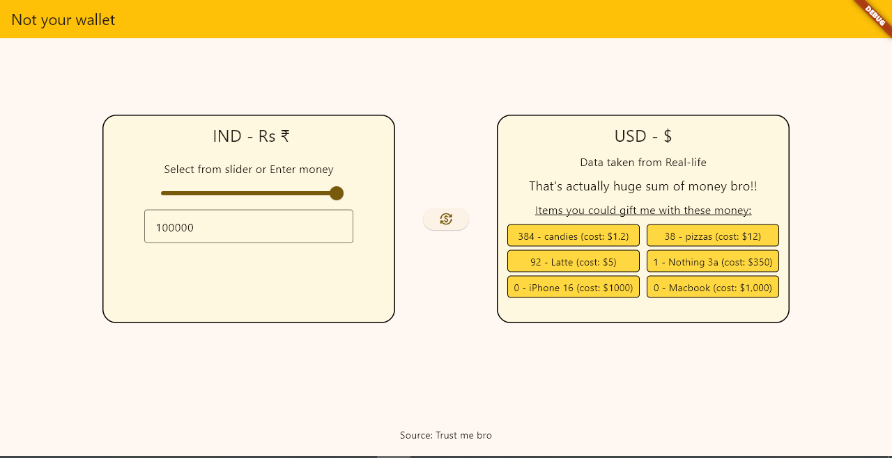

# Not your wallet (Currency converter)

A currency converter that tells you what your money is actually worth.

Instead of simply converting INR -> USD, **Not your wallet** shows how many real world items you can buy with that money -- *from a cup of coffee to Macbook*.

This is just a simple project meant for learning flutter.

---

## Motivation

I wanted to learn flutter -- just getting started.

So, i wanted to build really very simple project. I asked my friend and he gave me an assignment.

> Make a currency converter 🗣

I took it and mixed it with some of creativity, giving birth to *Not your wallet*.

Therfore, this app not only converts the currency but instead, it also tells you how many items you could actually buy.

---

## Features

- Convert INR -> USD
- Interactive money slider
- Manual amount entry
- Instant conversion of money
- *plus* Displays how many items you could buy
- Some funny messages will be displayed

---

## Preview



---

## Built with 

As stated early,

- Flutter
- Dart 
- Nothing else

---

## Download

If you want to try it out, please try it.

There are two methods to try this one.

### using releases (Beginner version)

1. Go to **Releases** section of this repo.
2. Download the latest zip file.
3. Extract it.
4. Run the ```.exe``` file from it.

---

## Using Git (Advanced version)

- Clone the repo

```git clone https://github.com/Serwindev/Currency-converter.git ```

- Move into the project

``` cd Currency-converter```

- Install dependencies

``` flutter pub get```

- Run it

``` flutter run```

---

## Disclaimer

- Exchange rates are for demonstration purpose alone
- Gift item prices are approximate and intended to be fun.
- No Macbooks were purchased during development.

---

### Support

If you enjoyed this project or found it interesting, consider giving the repository a star. It helps others discover the project and motivates me to build more fun applications!

---

Made with ❤️ by Serwin